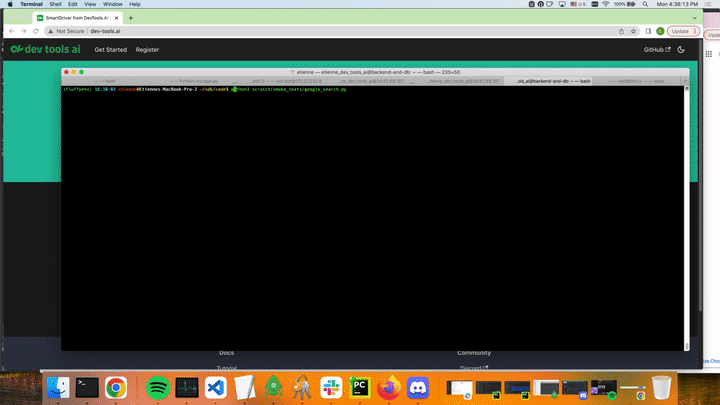

import Tabs from '@theme/Tabs';
import TabItem from '@theme/TabItem';

# Use Interactive Mode to Build New Test Cases
SmartDriver helps you write tests faster by skipping the need to build selectors for each element. Instead it will pause the test when an element isn't known so you can teach the bot where the element is on the screen.

## Enable SmartDriver Interactive Mode
To enable SmartDriver first set an environment variable to tell SmartDriver to pause tests when it doesn't find an element, which allows you to teach it where those elements are on the screen.
<Tabs groupId="OS-choice">
<TabItem value="mac" label="MacOS">

```sh
export DEVTOOLSAI_INTERACTIVE=TRUE
```

</TabItem>
<TabItem value="windows" label="Windows">

```sh
set DEVTOOLSAI_INTERACTIVE=TRUE
```

</TabItem>
<TabItem value="linux" label="Linux">

```sh
export DEVTOOLSAI_INTERACTIVE=TRUE
```

</TabItem>
</Tabs>

## Interactive Mode Quickstart
The best way to use interactive mode is when writing new test cases. You can start with writing out test steps in your preferred language, using the `find_by_ai()` method for the elements.


### Write Out Test Steps
An example for searching Google would look like the following.

<Tabs groupId="language-choice">
<TabItem value="py" label="Python">

```py
searchbox_element = driver.find_by_ai("searchbox")
searchbox_element.send_keys("hello world\n")
```

</TabItem>
<TabItem value="java" label="Java">

```java
WebElement searchBoxElement = driver.findByAI("searchbox");
searchBoxElement.sendKeys("hello world\n");
```

</TabItem>
<TabItem value="csharp" label="C#">

```c#
Coming soon.
```

</TabItem>
<TabItem value="js" label="JavaScript">

```js
Coming soon.
```

</TabItem>
<TabItem value="rb" label="Ruby">

```rb
Coming soon.
```

</TabItem>
</Tabs>

### Execute Test
*After* enabling interactive mode, run your test as normal. When SmartDriver tries to execute a step where it doesn't see the label, then it will open a new window to allow you to label the element.

Below is an example of this in action:
