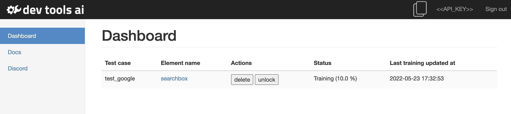
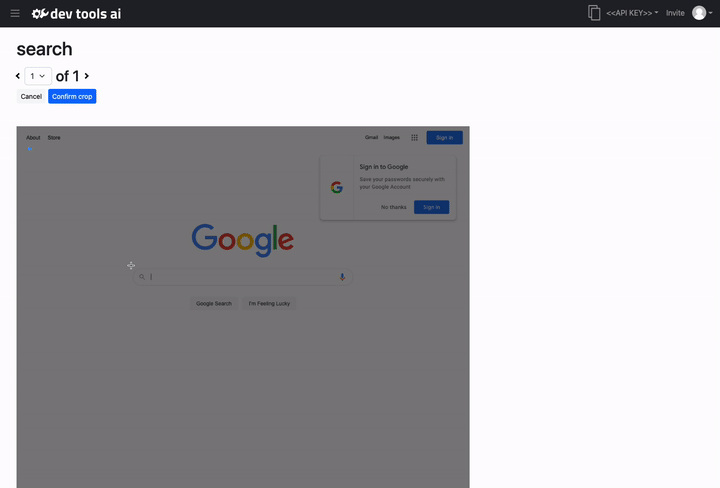

# Web UI

Through the SmartDriver web portal you can manage your data, and train the AI to learn what elements are.

## Dashboard
The dashboard is the main screen where you can see all test cases and labels seen by SmartDriver. You can click on an element name to view the data used to teach the AI.

### Lock/ Unlock
When an element is locked, it will not take additional training examples when you execute tests. By default, elements are locked unless unlocked by you.

## Labeler
The labeler is where you teach the AI where a specified element is on the page.

### How to Label
You will need to draw a bounding box around the element. To do this

1) Click "Edit bounding box" which will enable the editor.

2) Click and drag a box on rhe image to highlight the element on the screen.

3) When you have the box around element, click "Confirm Crop"

:::tip Tip

For best results, make the crop around the element as close to the element as possible.

:::

